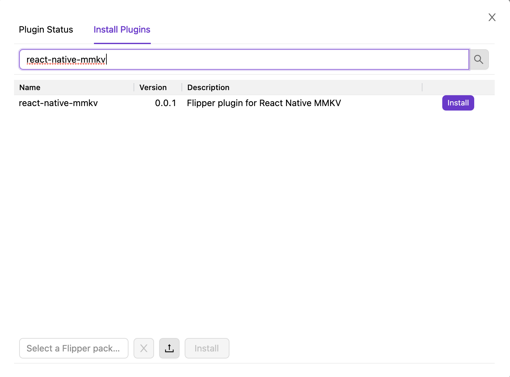

# Flipper plugin for [react-native-mmkv](https://github.com/mrousavy/react-native-mmkv)

This plugin allows you to control react-native-mmkv from flipper

## Usage

### Install the flipper plugin.

Simply search for 'react-native-mmkv' in the `Plugin Manager` in Flipper.

<p align="center">
    
</p>

### In your react-native App

```sh
yarn add -D react-native-flipper
yarn add react-native-mmkv-flipper-plugin
```

```ts
import { MMKV } from "react-native-mmkv";
import { useMMKVFlipper } from "react-native-mmkv-flipper-plugin";
const instance = new MMKV();

// add this line inside your App.tsx
useMMKVFlipper(storage);
```

## Screenshot


